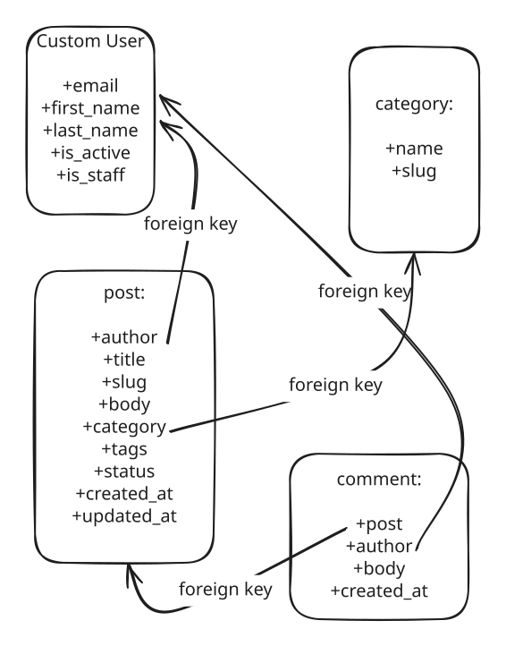

# Blog API — Homework 1

A Django REST API with email-based users, JWT authentication, posts, comments,
categories, and tags. Local development uses SQLite; production uses PostgreSQL.

## Database design



The original planning file is preserved at `docs/ERD.excalidraw`. The exported ERD
includes all required models and the automatic post/tag join table.

## Quick start

Requires Python 3.12 or newer and Git. Run commands from the project root.

```bash
git clone https://github.com/ayegenberdiyeva/blog-api.git
cd blog-api
python3 -m venv .venv
source .venv/bin/activate
python -m pip install -r requirements/dev.txt
cp settings/.env.example settings/.env
python -c "import secrets; print(secrets.token_urlsafe(64))"
```

Paste the generated value into `BLOG_SECRET_KEY` in `settings/.env`. Keep
`BLOG_ENV_ID=local` for SQLite. Never commit `.env` or real credentials.
If you already have a configured `.env`, preserve it instead of copying over it.

```bash
python manage.py migrate
python manage.py createsuperuser
python manage.py runserver
```

Open `http://127.0.0.1:8000/api/` for the browsable API and
`http://127.0.0.1:8000/admin/` for administration. The site root `/` has no page.
The superuser command asks for email, first name, last name, and a password.
No default account or preset administrator password is included.

On Windows, activate with `.venv\Scripts\activate` instead.

## Structure

```text
manage.py
pyproject.toml
requirements/
    base.txt                 # Shared dependencies
    dev.txt                  # Shared dependencies + Ruff
    prod.txt                 # Shared dependencies + PostgreSQL driver and Gunicorn
apps/
    auths/                   # User model, manager, registration, JWT, admin, tests
    blog/                    # Blog models, serializers, permissions, CRUD, tests
settings/
    .env                     # Local secrets, ignored by Git
    .env.example             # Safe configuration template
    conf.py                  # Environment-file loading
    base.py                  # Shared settings
    urls.py
    wsgi.py
    asgi.py
    env/
        local.py             # DEBUG=True, SQLite
        prod.py              # DEBUG=False, PostgreSQL and HTTPS defaults
logs/                        # Runtime logs ignored; .gitkeep retains the directory
docs/
    erd.svg
    ERD.excalidraw
```

## Configuration

`manage.py` reads `BLOG_ENV_ID` through the environment loader and selects
`settings.env.local` or `settings.env.prod`. The environment module imports
`settings.base`, which gets configuration from `settings.conf`. WSGI and ASGI
use the same selector. Unknown environment IDs fail with a clear error.
An explicitly supplied `DJANGO_SETTINGS_MODULE` remains supported for tooling.

Environment variables set by the operating system override `.env` values.
All application configuration variables use the `BLOG_` prefix.

| Variable | Purpose |
| --- | --- |
| `BLOG_ENV_ID` | `local` (default) or `prod` |
| `BLOG_SECRET_KEY` | Required unique, private Django secret |
| `BLOG_ALLOWED_HOSTS` | Comma-separated hostnames, without schemes |
| `BLOG_CSRF_TRUSTED_ORIGINS` | Comma-separated trusted HTTPS origins |
| `BLOG_DB_NAME` | Production database name |
| `BLOG_DB_USER` | Production database user |
| `BLOG_DB_PASSWORD` | Production database password |
| `BLOG_DB_HOST` | Production database hostname or socket directory |
| `BLOG_DB_PORT` | Production port; defaults to 5432 |

The local environment does not require PostgreSQL credentials. Logs go to the
console by default. The `logs/` directory is available for file logging.

## Authentication and routes

All API routes use trailing slashes. Detail routes use numeric IDs.

| Method | Route | Purpose |
| --- | --- | --- |
| POST | `/api/auth/register/` | Create a regular user |
| POST | `/api/auth/token/` | Log in with email/password; receive access and refresh tokens |
| POST | `/api/auth/token/refresh/` | Exchange a refresh token for an access token |
| GET, POST | `/api/posts/` | List visible posts or create a post |
| GET, PUT, PATCH, DELETE | `/api/posts/{id}/` | Read, update, or delete a post |
| GET, POST | `/api/comments/` | List visible comments or create a comment |
| GET, PUT, PATCH, DELETE | `/api/comments/{id}/` | Read, update, or delete a comment |
| GET, POST | `/api/categories/` | List or create categories |
| GET, PUT, PATCH, DELETE | `/api/categories/{id}/` | Read, update, or delete a category |
| GET, POST | `/api/tags/` | List or create tags |
| GET, PUT, PATCH, DELETE | `/api/tags/{id}/` | Read, update, or delete a tag |

Send `Authorization: Bearer <access-token>` with authenticated API requests.
Access tokens last 30 minutes; refresh tokens last one day. Admin login uses
Django's session authentication separately from JWT API authentication.

### Permissions and behavior

The assignment does not prescribe endpoint permissions. This implementation uses:

- Anyone can read published posts, their comments, categories, and tags.
- Logged-in users can create posts and comment on posts they can see.
- Drafts and their comments are visible only to the post author and staff.
- Only the content's author or staff can edit/delete posts and comments.
- Only staff can create, edit, or delete categories and tags.
- Author IDs are assigned from the authenticated user and cannot be supplied or
  changed by clients. Comments cannot be moved to another post.
- Registration cannot grant staff/superuser permissions. Password validation is
  enabled; plaintext passwords are never stored or returned.
- Emails are stored lowercase; registration uniqueness and login are case-insensitive.
- New posts default to `draft`. Clients supply unique, URL-friendly slugs.
- Category can be `null` and tags can be omitted or `[]`.
- Deleting a category clears the post's category. Deleting a user deletes their
  posts and comments. Deleting a post deletes its comments. Deleting a tag leaves posts intact.

List results use `count`, `next`, `previous`, and `results`, with 20 items per page.
Use `?page=2`, `?search=django`, and `?ordering=-created_at` where supported.
Post search covers title/body; comment search covers body; taxonomy search covers name/slug.

### Try the API

Register a test account (choose your own password):

```bash
curl -X POST http://127.0.0.1:8000/api/auth/register/ \
  -H 'Content-Type: application/json' \
  -d '{"email":"reader@example.com","first_name":"Test","last_name":"Reader","password":"Choose-Your-Own-Passphrase42!"}'
```

Log in:

```bash
curl -X POST http://127.0.0.1:8000/api/auth/token/ \
  -H 'Content-Type: application/json' \
  -d '{"email":"reader@example.com","password":"Choose-Your-Own-Passphrase42!"}'
```

Copy the returned access token into this shell variable, then create a post:

```bash
ACCESS_TOKEN='paste-your-access-token-here'
curl -X POST http://127.0.0.1:8000/api/posts/ \
  -H "Authorization: Bearer $ACCESS_TOKEN" \
  -H 'Content-Type: application/json' \
  -d '{"title":"My first post","slug":"my-first-post","body":"Hello!","status":"published","category":null,"tags":[]}'
```

Use the returned post ID in the next request (replace `1` if needed):

```bash
curl -X POST http://127.0.0.1:8000/api/comments/ \
  -H "Authorization: Bearer $ACCESS_TOKEN" \
  -H 'Content-Type: application/json' \
  -d '{"post":1,"body":"My first comment"}'
```

Refresh an expired access token:

```bash
curl -X POST http://127.0.0.1:8000/api/auth/token/refresh/ \
  -H 'Content-Type: application/json' \
  -d '{"refresh":"paste-your-refresh-token-here"}'
```

## Validation and code standards

```bash
python manage.py check
python manage.py makemigrations --check --dry-run
python manage.py test
ruff check .
ruff format --check .
```

The test suite checks user creation, required fields, email uniqueness, password
hashing, superuser/admin behavior, JWT login and refresh, CRUD permissions, draft
privacy, relationship deletion, timestamps, and model/API validation.
Ruff enforces formatting, annotated functions, and the assignment's import order:
standard library, third-party packages, REST framework, Django, then local modules.
Django-generated migrations are excluded from hand-written-code lint rules.

## Production configuration

Use a provisioned PostgreSQL 14+ database and install production dependencies:

```bash
python -m pip install -r requirements/prod.txt
```

Set `BLOG_ENV_ID=prod`, all `BLOG_DB_*` variables, a unique secret, the actual
allowed hosts, and trusted HTTPS origins. Then run:

```bash
python manage.py check --deploy
python manage.py migrate
python manage.py collectstatic --noinput
gunicorn settings.wsgi:application
```

Serve collected static files through your web server and configure HTTPS.
Production forces HTTPS and uses secure cookies and HSTS. If you terminate TLS
at a proxy, configure Django's trusted proxy header only after ensuring the proxy
strips untrusted incoming values. Hosting/deployment is outside this homework.

## Git workflow

Homework 1 is developed on `hw1`, merged into `main`, and the homework branch is
retained. Future homeworks use `hw2`, `hw3`, and so on with the same pattern.

## References

- [Django custom users](https://docs.djangoproject.com/en/5.2/topics/auth/customizing/)
- [Django REST framework permissions](https://www.django-rest-framework.org/api-guide/permissions/)
- [Simple JWT setup](https://django-rest-framework-simplejwt.readthedocs.io/en/stable/getting_started.html)
- [python-decouple configuration](https://pypi.org/project/python-decouple/)
